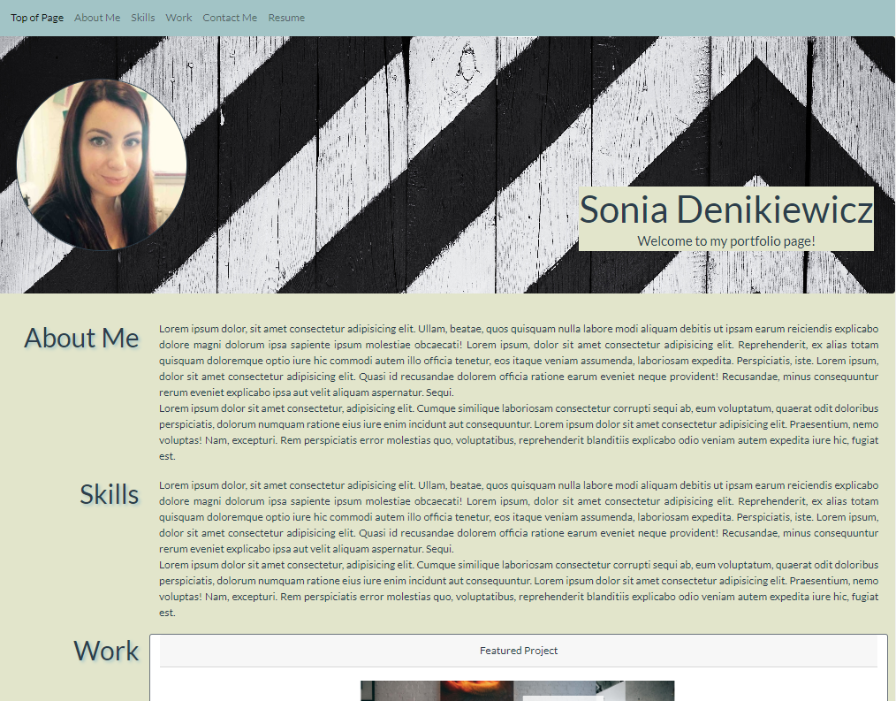

# Bootstrap Portfolio - Bootcamp Week 3

## UX and Advanced CSS: Bootstrap Portfolio

This page has been created to update the previous portfolio page that I created, by using Bootstrap 4 elements and styling them. Cards are used to showcase different projects with one featured project that is larger than the rest. Hperlinks have hover effects and buttons have box shadows upon hover.

## Usage

Here is a mock up of the page:

## Credits

[Assignment] https://courses.bootcampspot.com/courses/3021/assignments/44738?module_item_id=832192

[FreeCodeCamp] https://www.freecodecamp.org/learn/2022/responsive-web-design/build-a-survey-form-project/build-a-survey-form

[Odin Project] https://www.theodinproject.com/lessons/foundations-recipes

## Link to deployed application

https://sonia-deni.github.io/Bootstrap-Portfolio/

## License

This project is licensed under the MIT License

## Badges

